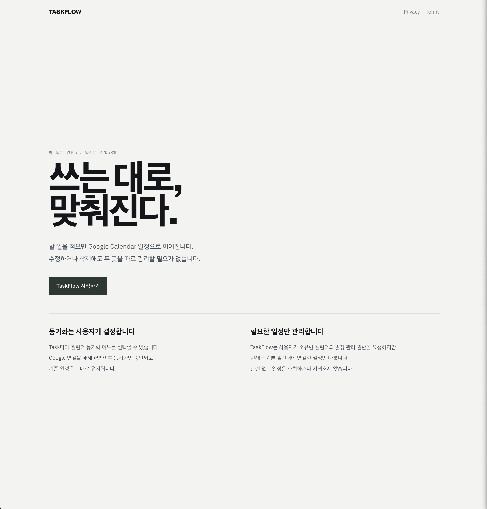
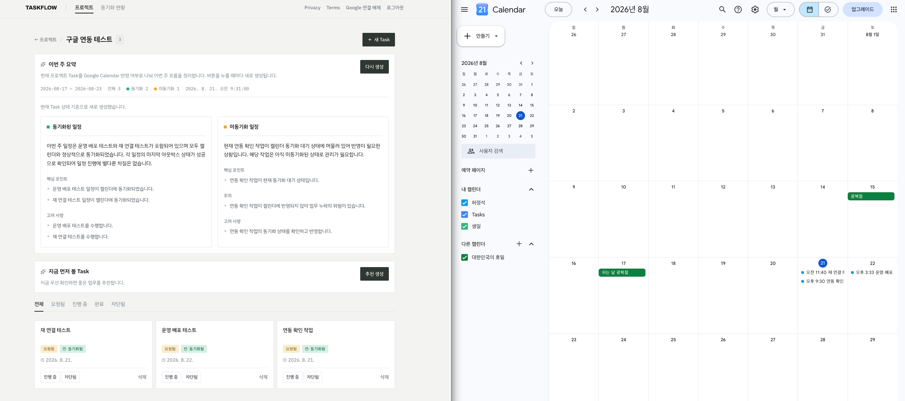
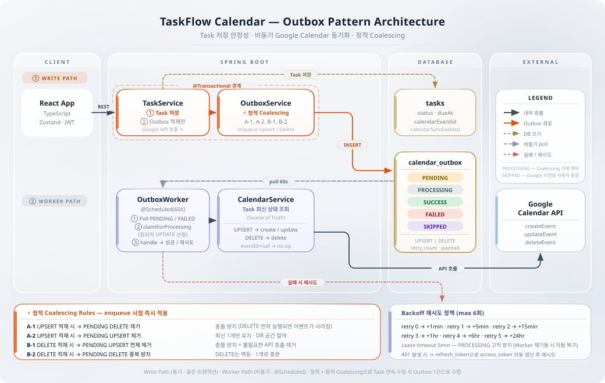
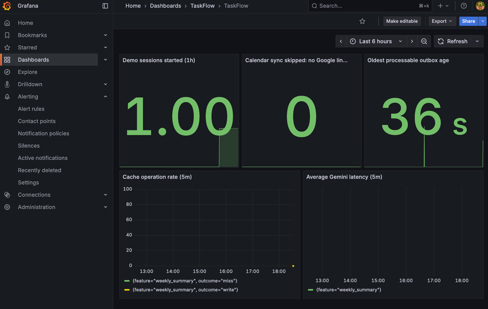

# TaskFlow Calendar

> 할 일을 적으면 Google Calendar 일정으로 이어지는 작업 관리 서비스

**[taskflow.heojungseok.com](https://taskflow.heojungseok.com)** · [Privacy Policy](https://taskflow.heojungseok.com/privacy) · [Terms](https://taskflow.heojungseok.com/terms)

Google 계정으로 로그인하면 Task가 Google Calendar 일정으로 생성·수정·삭제까지 따라갑니다.
계정 없이 둘러보려면 데모 로그인을 사용할 수 있습니다. 데모 데이터는 방문자별로 격리되고 24시간 뒤 삭제됩니다.



외부 API는 항상 실패할 수 있다고 가정하고, **Outbox 패턴**으로 Task 저장 트랜잭션과 Google Calendar 호출을 분리했습니다.

## 주요 기능

- Task CRUD, 상태 전이(`TaskStatusPolicy`), 변경 이력(`TaskHistory`)
- 프로젝트 목록 최신순/오래된순 정렬, 검색 결과와 전체 목록 분리 표시
- Google OAuth 2.0 로그인 및 데모 로그인
- Google Calendar 단방향 동기화 (Task 생성·수정·삭제 → Calendar event)
- Google 연결 해제·재연결 (token revoke 후 삭제)
- 동기화 현황 조회 (Outbox 상태, Task별 sync state)
- 프로젝트별 주간 업무 요약 (Gemini) · 우선순위 추천 (Gemini)
- 자연어 Task 검색 (structured intent + pgvector semantic recall)
- Prometheus / Grafana 기반 운영 관측



## 기술 스택

| 구분 | 사용 기술 |
|---|---|
| Backend | Java 17, Spring Boot 3.5.9, Spring Data JPA, Spring Security, Gradle 8.14 |
| Database | PostgreSQL 17.11 + pgvector 0.8.6 |
| Frontend | React 19, TypeScript 5.9, Vite 7, Framer Motion |
| External | Google Calendar API, Google Gemini API, Redis (선택) |
| Ops | Docker Compose, Nginx, Flyway, Cloudflare Tunnel, Prometheus, Grafana |
| CI | GitHub Actions (Java 17, Node.js 22) |

## 아키텍처

### Outbox 패턴 + 정적 Coalescing



Task 저장 트랜잭션 안에서는 Outbox 레코드만 만들고, 별도 Worker가 비동기로 Google Calendar를 호출합니다.
API가 실패해도 Task 데이터는 보존되며, Worker는 Exponential Backoff로 재시도합니다 (`maxRetry=6`).

Outbox 레코드는 5가지 상태(`OutboxStatus`)를 가집니다.

| 상태 | 의미 |
|---|---|
| `PENDING` | 적재 완료, Worker 처리 대기 |
| `PROCESSING` | Worker가 선점해 처리 중 |
| `SUCCESS` | Google Calendar 반영 완료 |
| `FAILED` | 재시도 한도(6회) 초과로 종결 |
| `SKIPPED` | Google 미연동 사용자의 요청. 호출 없이 종결하며 재시도하지 않음 |

작업 종류(`OutboxOpType`)는 `UPSERT`(생성·수정)와 `DELETE` 둘입니다.

**정적 Coalescing (4 Rules)** — Outbox 적재 시점에 불필요한 레코드를 제거합니다.

| Rule | 적재 시점 | 대상 | 목적 |
|------|----------|------|------|
| A-1 | `UPSERT` | `PENDING` 상태의 `DELETE` 삭제 | 도메인 충돌 해소 |
| A-2 | `UPSERT` | `PENDING` 상태의 `UPSERT` 삭제 | 최신 1개만 유지 |
| B-1 | `DELETE` | `PENDING` 상태의 `UPSERT` 삭제 | 도메인 충돌 해소 |
| B-2 | `DELETE` | `PENDING` 상태의 `DELETE` 중복 방지 | 효율성 |

A-1과 B-1이 UPSERT와 DELETE가 동시에 PENDING으로 남는 상황을 막기 때문에, 한 Task에 대해 항상 하나의 의도만 대기합니다.

**Lease Timeout** — `PROCESSING` 상태로 5분이 지나면 다시 처리 대상이 되므로, Worker가 중간에 죽어도 수동 개입 없이 재처리됩니다.

**Race Condition 방어** — `deleteByTaskIdAndStatusAndOpType()`은 `status = PENDING`만 삭제합니다. Worker가 선점한 `PROCESSING` 레코드는 Coalescing 대상에서 자동 제외됩니다.

### 인증

Google OAuth 또는 데모 로그인 후 JWT를 HttpOnly 세션 쿠키로 전달하고, 상태 변경 요청은 CSRF 토큰으로 보호합니다.

Google 권한은 `calendar.events.owned` 하나만 요청합니다. 사용자가 소유한 캘린더의 일정만 다루고 다른 일정 목록은 가져오지 않기 때문에, 더 넓은 `calendar.events` 대신 최소 범위를 선택했습니다. 콜백에서 granted scope에 이 값이 없으면 token을 저장하지 않고 로그인 화면으로 되돌립니다.

로그아웃은 앱 세션만 종료하고 Google 연결은 유지합니다. 연결 해제는 Google token revoke → DB token 삭제 → 세션 종료 순으로 동작하며, 이미 만들어진 Calendar 일정은 지우지 않습니다.

### 도메인 설계

- **Rich Domain Model** — `outbox.markAsSuccess()`처럼 Entity에 명령하면 내부 상태 정리는 Entity가 처리합니다 (Tell, Don't Ask).
- **Static Factory Method** — `CalendarOutbox.forUpsert(taskId, payload)`는 항상 `PENDING` + `retryCount=0`으로 생성합니다. Builder를 노출하면 잘못된 초기 상태가 만들어질 수 있습니다.
- **단방향 `@ManyToOne`** — 컬렉션 매핑을 두지 않고, 필요한 조회에서 `@EntityGraph`나 명시 쿼리로 가져옵니다.
- **Soft Delete** — Calendar 삭제가 비동기로 처리되고 이력 추적이 필요해서 논리 삭제를 씁니다. 현재 복구 UI나 API는 없습니다.
- **DTO 기반 API** — Entity를 직접 노출하지 않습니다.

### 관측과 장애 대응

Prometheus가 backend metric을 수집하고 Grafana가 대시보드와 알림을 담당합니다. 대시보드는 데모 세션 수, `SKIPPED` Outbox, 가장 오래된 처리 대기 Outbox, 캐시 결과 분포, Gemini 응답 시간을 표시합니다.

알림 규칙 6종을 활성화하고 Discord 연동을 검증했습니다. 운영에서는 6종 모두 활성 상태이며, demo usage와 abuse 알림은 메트릭이 없을 때 0으로 평가해 No data 오탐을 방지합니다.

| 알림 | 조건 | severity |
|---|---|---|
| backend down | `up{job="taskflow"} < 1`, 2분 지속 | critical |
| worker backlog | 처리 대기 Outbox 최고 연령 > 120초, 2분 지속 | warning |
| cleanup failure | 15분간 데모 정리 실패 발생 | warning |
| cleanup overdue | 만료 데모 데이터 최고 연령 > 600초, 5분 지속 | warning |
| demo usage | 1시간 데모 세션 3건 이상 + `SKIPPED` Outbox 5건 이상 | warning |
| abuse | 10분간 데모 세션 20건 또는 `SKIPPED` Outbox 50건 | warning |



알림을 받는 사람이 바로 움직일 수 있도록, Discord 메시지에 **영향 / 발생 시각 / 대상 서비스 / 권장 조치 / 1차 가용성 확인 URL**을 함께 보냅니다. 복구되면 `[복구]` 메시지로 종료를 알립니다. 임계값만 던지는 알림은 결국 무시된다고 보고, 알림 본문 자체를 짧은 런북으로 만들었습니다.

## 로컬 실행

### 사전 요구사항

Java 17, Node.js 22, Docker & Docker Compose

### 실행

```bash
git clone https://github.com/heojungseok/taskflow-calendar.git
cd taskflow-calendar
cp .env.example .env   # JWT_SECRET, GOOGLE_CLIENT_ID/SECRET 채우기
docker compose up -d postgres
./gradlew bootRun
```

별도 터미널에서 frontend를 띄웁니다.

```bash
cd frontend
npm ci
npm run dev
```

접속 주소는 **http://localhost:3000** 입니다. Vite dev server가 `/api` 요청을 backend 8080으로 proxy합니다.

환경 변수는 `.env.example`에 설명과 기본값이 있습니다. 필수값은 `JWT_SECRET`, `GOOGLE_CLIENT_ID`, `GOOGLE_CLIENT_SECRET` 세 개이고 나머지는 로컬 기본값으로 동작합니다. `bootRun`은 `build.gradle` 설정으로 `.env`를 자동 로드하지만, IDE에서 직접 실행하면 반영되지 않으므로 환경 변수를 직접 export해야 합니다.

Google Calendar 동기화까지 로컬에서 확인하려면 `.env`에 `OUTBOX_WORKER_ENABLED=true`를 추가하세요. 기본값은 `false`입니다.

### 종료

```bash
docker compose stop     # 애플리케이션은 Ctrl + C
```

> `docker compose down -v`는 DB 볼륨까지 삭제합니다. 데이터를 버릴 때만 사용하세요.

## 검증

```bash
./gradlew test
```

```bash
cd frontend && npm run lint && npm run build
```

```bash
docker compose -p taskflow-public --env-file .env.production.example -f compose.production.yml config --quiet
```

## 트러블슈팅

| 증상 | 원인 | 해결 |
|---|---|---|
| Task를 만들어도 Google Calendar에 안 생김 | Outbox Worker가 기본 비활성 (`OUTBOX_WORKER_ENABLED:false`). 설정 누락 상태로 기존 Outbox를 처리하지 않도록 한 기본값 | `.env`에 `OUTBOX_WORKER_ENABLED=true` 추가 |
| 자연어 검색은 되는데 의미 검색이 안 걸림 | PostgreSQL에 `pgvector` extension이 없으면 semantic recall이 조용히 꺼짐 (`postgres:14-alpine`을 쓰다 겪음) | `docker-compose.yml`의 `pgvector/pgvector:0.8.6-pg17` 사용. 다이제스트까지 고정돼 있음 |
| 동기화가 `Request had insufficient authentication scopes`로 실패 | Google 동의 화면에서 Calendar 권한을 체크하지 않은 grant. access token은 나오지만 Calendar 호출 권한이 없음 | 연결 해제 후 다시 로그인하며 권한 승인. 현재는 콜백에서 scope를 선검사해 `calendar_permission_required`로 되돌림 |
| Worker를 켰는데도 Calendar에 안 생김 | Google 미연동 사용자(데모 로그인)의 Outbox는 Google을 호출하지 않고 `SKIPPED`로 종결. 재시도 대상이 아님 | Google 로그인으로 연동한 계정에서 확인 |
| IDE로 실행하면 `.env` 값이 안 먹음 | `.env` 로드는 `build.gradle`의 `bootRun` 태스크가 직접 읽어 system property로 넣는 방식. IDE Run Configuration은 이 태스크를 거치지 않음 | `./gradlew bootRun`으로 실행하거나 Run Configuration에 값을 직접 지정 |
| 주간 요약이 예전 내용으로 나옴 | 캐시를 켠 상태(`WEEKLY_SUMMARY_CACHE_ENABLED=true`)에서 Gemini 429가 나면 마지막 성공 요약으로 fallback. 캐시가 꺼져 있으면 fallback 없이 오류를 반환 | 정상 동작. 응답의 `cacheStatus`가 `STALE_FALLBACK`인지 확인 |

## API 엔드포인트

### Auth
| Method | Path | 설명 |
|---|---|---|
| GET | `/api/auth/session` | 현재 세션 조회 |
| POST | `/api/auth/demo` | 데모 로그인 |
| POST | `/api/auth/logout` | 로그아웃 (앱 세션만 종료) |

### Google OAuth
| Method | Path | 설명 |
|---|---|---|
| GET | `/api/oauth/google/authorize` | 인증 URL 발급 |
| GET | `/api/oauth/google/callback` | OAuth 콜백 |
| POST | `/api/oauth/google/disconnect` | 연결 해제 (token revoke·삭제) |

### Project
| Method | Path | 설명 |
|---|---|---|
| POST | `/api/projects` | 프로젝트 생성 |
| GET | `/api/projects` | 프로젝트 목록 |
| GET | `/api/projects/{projectId}` | 프로젝트 상세 |

### Task
| Method | Path | 설명 |
|---|---|---|
| POST | `/api/projects/{projectId}/tasks` | Task 생성 |
| GET | `/api/projects/{projectId}/tasks` | Task 목록 |
| GET | `/api/tasks/{taskId}` | Task 상세 |
| PATCH | `/api/tasks/{taskId}` | Task 수정 |
| POST | `/api/tasks/{taskId}/status` | 상태 변경 |
| DELETE | `/api/tasks/{taskId}` | Task 삭제 (Soft Delete) |
| GET | `/api/tasks/{taskId}/history` | 변경 이력 |
| GET | `/api/tasks/{taskId}/calendar-sync` | 동기화 상태 |

### Outbox
| Method | Path | 설명 |
|---|---|---|
| GET | `/api/calendar-outbox` | Outbox 목록 |
| GET | `/api/calendar-outbox/{outboxId}` | Outbox 상세 |

### LLM
| Method | Path | 설명 |
|---|---|---|
| POST | `/api/projects/{projectId}/weekly-summary` | 주간 업무 요약 ([동작 방식](docs/weekly-summary.md)) |
| GET | `/api/projects/weekly-summary/cache-health` | 요약 캐시 헬스 체크 |
| GET | `/api/projects/{projectId}/task-recommendations` | 우선순위 추천 |
| POST | `/api/search/tasks` | 자연어 Task 검색 ([동작 방식](docs/search.md)) |

## ERD

```
users      1 ── N  projects
projects   1 ── N  tasks
users      1 ── N  tasks (optional assignee)
tasks      1 ── N  task_history
tasks      1 ── N  calendar_outbox
tasks      1 ── 1  task_search_embeddings
users      1 ── 1  oauth_google_tokens
```

## 설계 판단

**Outbox 패턴을 사용한 이유는?** <br/>
외부 API는 항상 실패할 수 있다고 가정했습니다. Task 저장 트랜잭션과 Google Calendar 호출을 분리해서, API가 죽어도 핵심 데이터는 남도록 했습니다.

**Outbox가 무한정 쌓이는 걸 어떻게 방지했는지?** <br/>
적재 시점에 정적 Coalescing 4개 규칙으로 불필요한 레코드를 지웁니다. Task를 연속으로 여러 번 수정해도 `PENDING` Outbox는 1개만 남습니다.

**정적 Coalescing과 동적 Coalescing의 차이** <br/>
정적은 적재 시점에 DB에서 지워 저장 공간과 Worker 조회 부하를 줄입니다. 동적은 처리 시점에 Task 최신 상태를 다시 읽어 중간 변경을 무시합니다. API 호출 횟수는 둘 다 1회지만, 정적은 DB 효율을 추가로 확보합니다.

**왜 양방향 JPA 관계를 쓰지 않았는지?** <br/>
컬렉션 매핑을 두면 의도치 않은 조회와 순환 참조가 생기기 쉽습니다. 단방향 ManyToOne으로 두고, 필요한 조회에서 `@EntityGraph`로 명시적으로 가져오는 편이 예측 가능하다고 판단했습니다.

**왜 로그아웃할 때 Google 연결을 끊지 않는지?** <br/>
두 동작의 의도가 다릅니다. 로그아웃마다 grant를 없애면 재로그인할 때마다 동의와 refresh token 발급을 반복해야 하고, 단순 세션 종료가 외부 연동 해제로 변질됩니다.

## 검증 시나리오

수치는 아래 시나리오 기준의 계산값이며, 프로덕션 부하 측정 결과가 아닙니다.

| 시나리오 | 적용 전 | 적용 후 |
|---|---|---|
| Task를 10회 연속 수정 | Outbox 10건, Google API 10회 | Outbox 1건, Google API 1회 |
| `TaskHistory` 100건 조회 | 연관 Task N+1 조회 | `@EntityGraph`로 조인 1회 |
| Worker가 처리 중 종료 | `PROCESSING` 상태로 고착 | Lease Timeout 5분 후 재처리 |
| `UPSERT`와 `DELETE`가 연속 발생 | 두 건이 동시에 `PENDING` | Rule A-1 / B-1로 한 건만 유지 |

## 개발 기록

설계 판단과 시행착오는 velog에 정리해 두었습니다.

- [TaskFlow 아키텍처 설계 ① — 도메인 모델부터 Outbox까지](https://velog.io/@jungseokheo/taskflow-3week-development-retrospective) — 공통 컴포넌트, Task 도메인과 JWT 인증, 외부 API 연동을 비동기로 분리하기까지
- [TaskFlow 아키텍처 설계 ② — Google OAuth 연동과 운영 가시성 확보](https://velog.io/@jungseokheo/taskflow-google-oauth-calendar-api) — OAuth 2.0 인증, Access Token 자동 갱신, 외부 API 예외 분류와 Outbox 관측 화면
- [TaskFlow LLM API 연동](https://velog.io/@jungseokheo/taskflow-llm-retrospective) — 주간 요약·우선순위 추천·자연어 검색에서 API 연결보다 어려웠던 입력 데이터 정리와 운영 이슈

## 연락처

- GitHub: [@heojungseok](https://github.com/heojungseok)
- Email: tjrwjdgj@gmail.com
