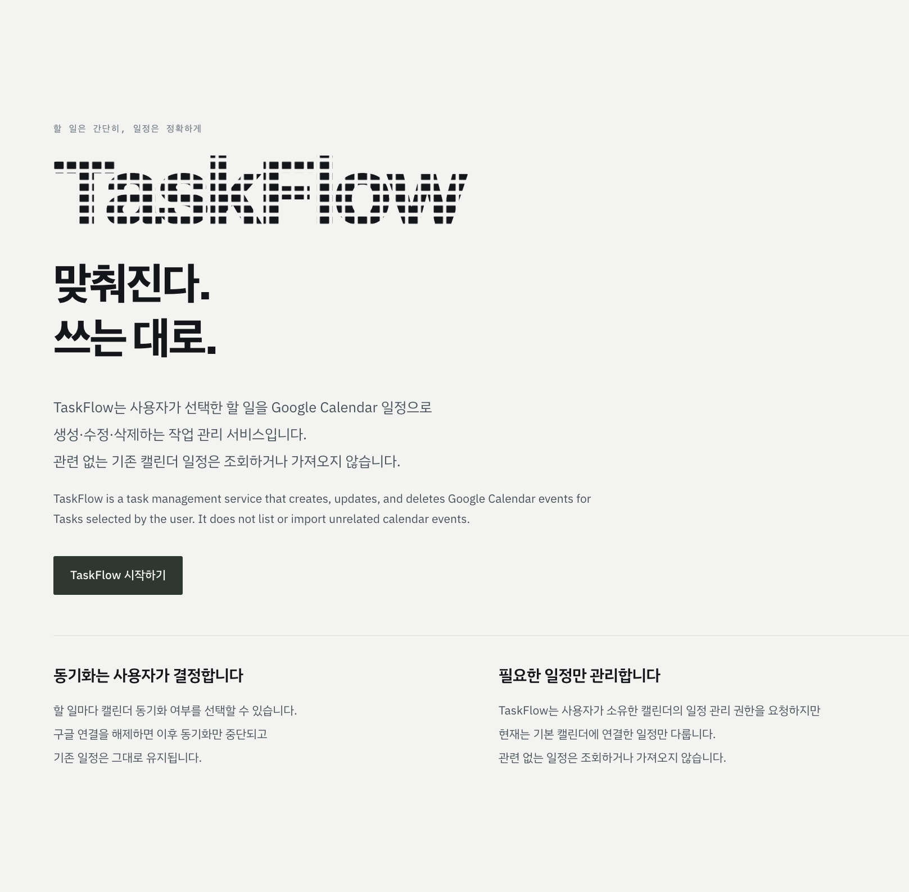
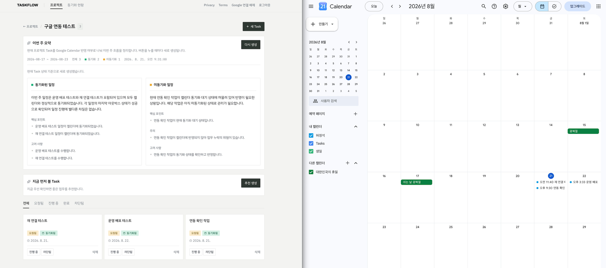
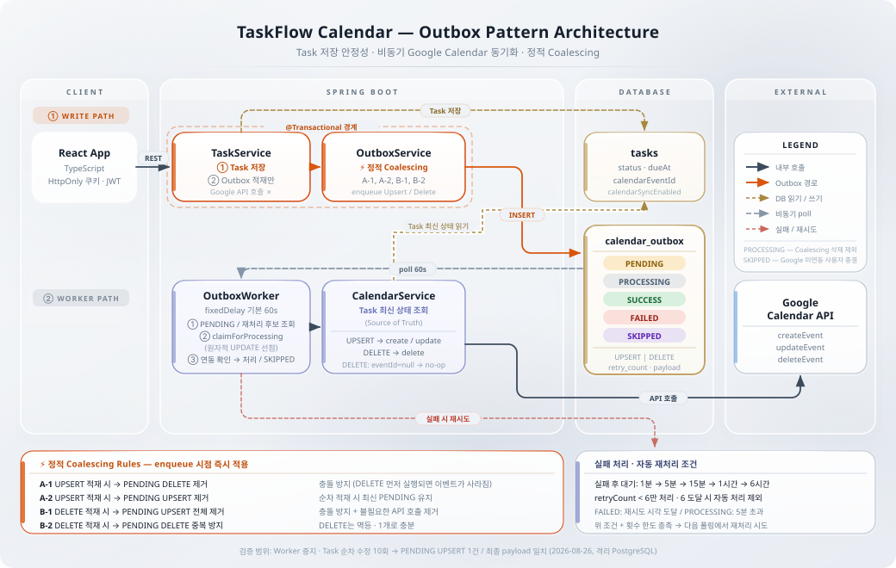
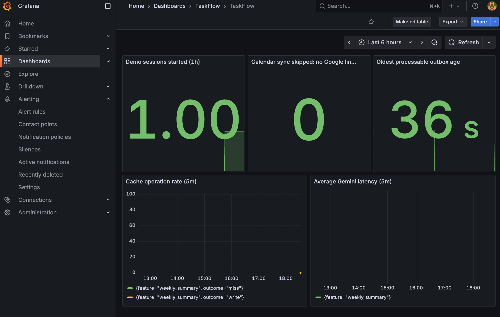
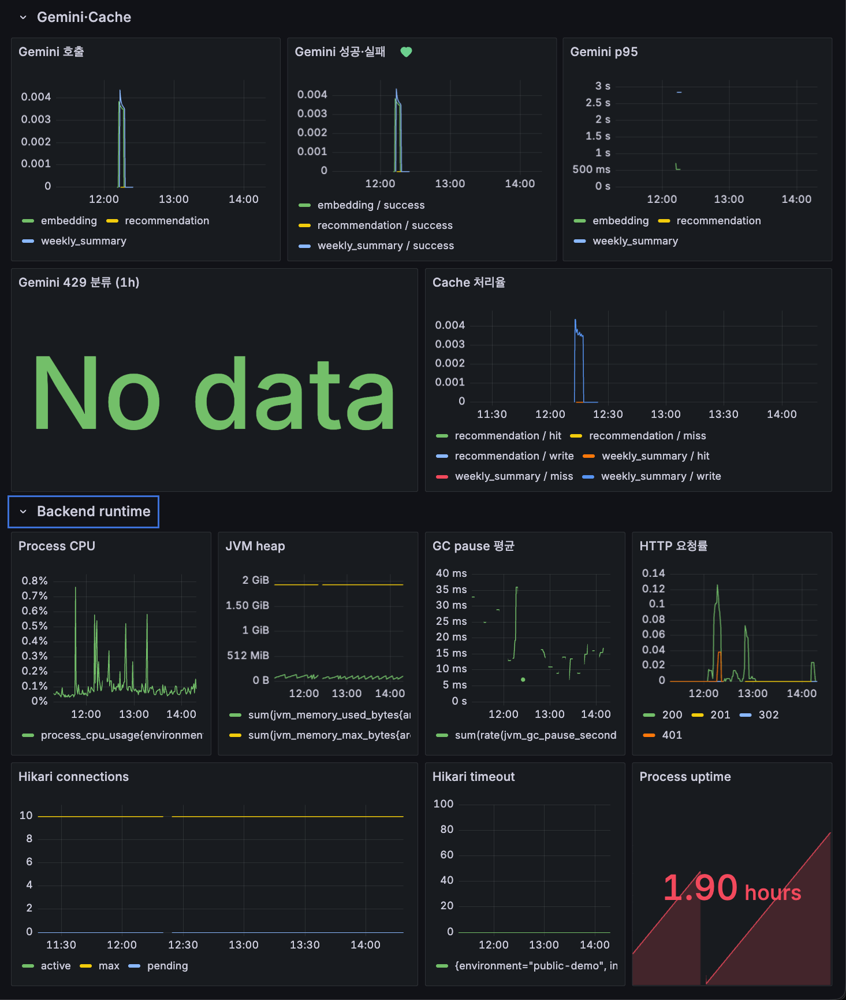

# TaskFlow Calendar

> 할 일을 적으면 Google Calendar 일정으로 이어지는 작업 관리 서비스

**[taskflow.heojungseok.com](https://taskflow.heojungseok.com)** · [Privacy Policy](https://taskflow.heojungseok.com/privacy) · [Terms](https://taskflow.heojungseok.com/terms)

Google 계정으로 로그인하면 Task가 Google Calendar 일정으로 생성·수정·삭제까지 따라갑니다.
계정 없이 둘러보려면 데모 로그인을 사용할 수 있습니다. 데모 데이터는 방문자별로 격리되고 24시간 뒤 삭제됩니다. 데모 로그인에서는 실제 Google Calendar를 호출하지 않습니다.

외부 API가 느리거나 실패해도 사용자의 Task는 저장돼야 한다고 판단했습니다. **Outbox 패턴**은 Task 변경과 외부 전송할 일을 같은 DB 트랜잭션에 기록하는 방식입니다. 별도 Worker가 그 기록을 읽어 Google Calendar를 호출하도록 구현해 저장과 동기화를 분리했습니다.

[검증 결과](#확인한-결과) · [구조와 설계 판단](#아키텍처와-설계-판단) · [운영·장애 대응](#관측과-장애-대응) · [개발 기록](#개발-기록) · [로컬 실행](#로컬-실행)

## 확인한 결과

| 검증 대상 | 확인한 결과 | 조건·근거 |
|---|---|---|
| 중간 변경 합치기 | 동일 Task 10회 수정 → 마지막 `PENDING UPSERT` 1건, 최종 payload 일치 | 격리 PostgreSQL·Worker 비활성·직렬 수정. [통제 측정 조건](#통제-측정-조건) |
| 외부 호출 실패 후 재처리 | `FAILED`에 재시도 횟수·시각 기록 → 다음 처리에서 `SUCCESS` | 외부 호출 부분만 첫 실패·두 번째 성공으로 통제. [통제 측정 조건](#통제-측정-조건) |
| 운영 Calendar 동기화 지연 | 23건 중앙값 **21.9초**, 22건은 60초 이내, 최대 **758.6초** | 2026-08-20~25 누적 운영 기록. [운영 관측 범위](#운영-관측-범위) |
| 장애 감지·복구 알림 | backend 중단 후 알림 발생 → 복구 알림, `Backend UP 1 → 0 → 1` | 2026-08-27 통제 중단·복구. [관측과 장애 대응](#관측과-장애-대응) |

### 통제 측정 조건

<details>
<summary>10회 수정·재처리 측정의 방법과 한계</summary>

2026-08-26 소스 `95b111974ebe4873b51c95fbc2d5ae93af8ee608`에서 운영 환경과 분리한 PostgreSQL로 두 시나리오를 측정했습니다.

- **중간 변경 합치기**: Worker를 끄고 실제 `TaskService.updateTask()`를 독립 트랜잭션으로 10회 직렬 호출했습니다. 남은 `PENDING UPSERT` 1건과 10번째 수정값이 일치했습니다. 실제 Google API 호출 1회, 동시 수정이나 운영 처리량을 측정한 결과는 아닙니다.
- **실패 후 재처리**: DB·Repository·Service·Worker는 실제 구현을 사용하고 `GoogleCalendarClient`만 첫 호출 실패·두 번째 호출 성공으로 통제했습니다. 첫 실패 후 `retryCount=1`과 1분 뒤 재시도 시각이 기록됐고 측정 DB의 재시도 시각을 과거로 옮겨 다음 처리에서 `SUCCESS`를 확인했습니다. 실제 Google 장애나 1분 실대기 검증은 아닙니다.

각 측정 테스트는 1건씩 성공했습니다. 당시 측정용 테스트·실행 기록은 저장소 밖에 보존하며 현재 CI 테스트와는 별도입니다. 구현과 기존 회귀 테스트는 [적재 서비스](src/main/java/com/taskflow/calendar/domain/outbox/CalendarOutboxService.java), [적재 규칙 테스트](src/test/java/com/taskflow/calendar/domain/outbox/CalendarOutboxServiceTest.java), [재처리 대상 테스트](src/test/java/com/taskflow/calendar/domain/outbox/CalendarOutboxProcessableTest.java), [Worker 테스트](src/test/java/com/taskflow/calendar/worker/CalendarOutboxWorkerTest.java)에서 확인할 수 있습니다.

</details>

### 운영 관측 범위

<details>
<summary>Calendar 동기화 23건의 집계 조건</summary>

2026-08-26 운영 DB의 `calendar_outbox`에서 `UPSERT`, `SUCCESS`, `retry_count=0`인 23건(서로 다른 Task 15건)을 집계했습니다. `created_at`부터 성공 상태로 갱신된 `updated_at`까지의 차이이며 브라우저의 Calendar 화면 갱신 시간은 포함하지 않습니다.

| 항목 | 결과 |
|---|---:|
| 중앙값 | 21.880초 |
| 60초 이내 | 22 / 23건 |
| 최대 | 758.649초 |

표본은 2026-08-20~25에 생성돼 여러 배포 버전이 섞인 누적 기록입니다. Worker 기본 주기는 60초이며 특정 버전의 부하 테스트나 응답 시간 보장으로 해석하지 않습니다. 최대 지연 1건은 당시 Worker 로그와 backend 가용성 시계열이 남아 있지 않아 원인을 확정하지 못했습니다.

</details>

## 주요 기능

- 프로젝트 단위로 Task를 만들고, 상태를 바꾸고, 누가 언제 무엇을 바꿨는지 이력을 봅니다
- Google 계정을 연결하면 Task 생성·수정·삭제가 Google Calendar 일정으로 이어집니다
- 계정 없이 데모 로그인으로 둘러볼 수 있습니다. 데모 데이터는 방문자별로 격리되고 24시간 뒤 삭제됩니다
- Google 연결은 언제든 해제·재연결할 수 있고, 해제할 때 저장된 토큰을 폐기합니다
- 동기화가 어디까지 갔는지 Task별로, Outbox 단위로 확인합니다
- 한 주의 업무를 요약하고 다음에 할 일을 추천합니다 (Gemini)
- "이번 주 안 끝난 거"처럼 말로 Task를 찾습니다
- 운영 상태를 대시보드와 알림으로 확인합니다 (Prometheus / Grafana)

<details>
<summary>서비스 홈 화면</summary>



</details>



## 아키텍처와 설계 판단

### 저장과 외부 호출 분리



Task 저장 트랜잭션 안에서는 Outbox 레코드만 만들고, 별도 Worker가 비동기로 Google Calendar를 호출합니다.
API가 실패해도 Task 데이터는 보존되며 재시도 가능한 실패에는 대기 시간을 늘리는 단계형 Backoff를 적용합니다. `retryCount < 6`인 항목만 처리 대상으로 조회합니다.

**선택 이유** — Task 저장과 Calendar 반영을 한 트랜잭션에 두면 Google이 느릴 때 사용자의 저장까지 같이 느려지고, API가 죽으면 Task 자체가 저장되지 않습니다. 사용자의 원본 데이터가 남의 서비스 가용성에 묶이는 구조라 제외했습니다. 저장 후 그 자리에서 비동기로 호출하는 방법은 호출 기록이 메모리에만 남아, 프로세스가 죽으면 무엇이 반영되지 않았는지 알 방법이 없습니다. 메시지 브로커는 이 문제를 풀지만 1인 운영에 브로커를 하나 더 세울 만큼 처리량이 크지 않습니다. Outbox는 이미 있는 PostgreSQL 트랜잭션 안에 "해야 할 일"을 남기므로, 인프라를 늘리지 않고 저장과 반영을 분리합니다.

<details>
<summary>Outbox 상태·적재 규칙·재처리 조건</summary>

Outbox 레코드는 5가지 상태(`OutboxStatus`)를 가집니다.

| 상태 | 의미 |
|---|---|
| `PENDING` | 적재 완료, Worker 처리 대기 |
| `PROCESSING` | Worker가 선점해 처리 중 |
| `SUCCESS` | 처리 완료. Calendar 반영 또는 삭제 대상이 없는 경우 등의 정상 종료 |
| `FAILED` | 처리 실패. 재시도 시각이 있고 횟수가 한도 미만이면 다시 처리하며, 재시도 시각이 없거나 횟수가 한도에 도달하면 자동 재처리 대상에서 제외 |
| `SKIPPED` | Google 미연동 사용자의 요청. 호출 없이 종결하며 재시도하지 않음 |

작업 종류(`OutboxOpType`)는 `UPSERT`(생성·수정)와 `DELETE` 둘입니다.

**정적 Coalescing(중간 변경 합치기)** — Outbox 적재 시점에 아래 네 규칙으로 아직 처리하지 않은 중간 변경을 정리합니다.

| Rule | 적재 시점 | 대상 | 목적 |
|------|----------|------|------|
| A-1 | `UPSERT` | `PENDING` 상태의 `DELETE` 삭제 | 도메인 충돌 해소 |
| A-2 | `UPSERT` | `PENDING` 상태의 `UPSERT` 삭제 | 최신 1개만 유지 |
| B-1 | `DELETE` | `PENDING` 상태의 `UPSERT` 삭제 | 도메인 충돌 해소 |
| B-2 | `DELETE` | `PENDING` 상태의 `DELETE` 중복 방지 | 효율성 |

같은 Task를 직렬로 변경할 때 기존 `PENDING` 의도를 제거하거나 중복 적재를 건너뜁니다. 이미 처리 중인 항목과 동시 요청까지 항상 한 건으로 합친다는 보장은 아닙니다.

**Lease Timeout(처리 점유 만료)** — `PROCESSING`의 마지막 갱신 후 5분이 지나고 재시도 한도 미만이면 다시 조회·선점할 수 있습니다. 멈춘 Worker가 남긴 항목을 후속 Worker가 회수하기 위한 조건이며 실제 재처리는 다음 폴링에서 이뤄집니다.

**Race Condition 방어** — `deleteByTaskIdAndStatusAndOpType()`은 `status = PENDING`만 삭제합니다. Worker가 선점한 `PROCESSING` 레코드는 Coalescing 대상에서 자동 제외됩니다.

</details>

적재 시점에는 `PENDING` 중간 변경을 합치고, 실제 UPSERT 처리 시점에는 Task의 최신 상태를 다시 읽습니다. 외부 호출 횟수는 Worker 실행 시점과 재시도 여부에 따라 달라집니다. [실제 Calendar 처리](src/main/java/com/taskflow/calendar/integration/googlecalendar/GoogleCalendarServiceImpl.java)

### 도메인 상태와 생성 규칙

- **Rich Domain Model** — `outbox.markAsSuccess()`처럼 Entity에 명령하면 내부 상태 정리는 Entity가 처리합니다 (Tell, Don't Ask).
- **Static Factory Method** — `CalendarOutbox.forUpsert(taskId, payload)`는 항상 `PENDING` + `retryCount=0`으로 생성합니다. 팩토리 메서드로 초기값을 통일했습니다. 현재 Builder도 공개돼 있어 다른 생성 경로까지 차단한 구조는 아닙니다.
- **단방향 `@ManyToOne`** — 컬렉션 매핑을 두지 않고, 필요한 조회에서 `@EntityGraph`나 명시 쿼리로 가져옵니다.
- **Soft Delete** — Calendar 삭제가 비동기로 처리되고 이력 추적이 필요해서 논리 삭제를 씁니다. 현재 복구 UI나 API는 없습니다.
- **DTO 기반 API** — Entity를 직접 노출하지 않습니다.

Task 상태 전이는 [TaskStatusPolicy](src/main/java/com/taskflow/calendar/domain/task/TaskStatusPolicy.java)에서 검증하고, Outbox의 성공·실패 처리는 [CalendarOutbox](src/main/java/com/taskflow/calendar/domain/outbox/CalendarOutbox.java)의 메서드로 묶습니다.

## 세션과 외부 권한

공개 서비스라 지금 요청을 보낸 사람이 누구인지, 그 권한이 언제까지 유효한지를 서버가 단독으로 판정해야 합니다.

Google OAuth 또는 데모 로그인 후 JWT를 HttpOnly 세션 쿠키로 전달하고 상태 변경 요청은 CSRF 토큰으로 보호합니다. 사용자 행의 세션 버전을 매 요청에 대조해 로그아웃과 연결 해제를 즉시 반영합니다. [인증 필터](src/main/java/com/taskflow/security/JwtAuthenticationFilter.java) · [세션 무효화 테스트](src/test/java/com/taskflow/calendar/domain/oauth/SessionInvalidationIntegrationTest.java)

<details>
<summary>세션 수명·최소 권한·토큰 보관 상세</summary>

**세션 수명** — Google 로그인 세션은 12시간, 데모 세션은 24시간입니다. 만료의 권위는 서버 JWT의 `exp`이고 브라우저는 경고를 띄울 시점만 계산합니다. 만료가 임박하면 안내 모달을 띄우고, 만료된 뒤의 요청은 로그인 화면으로 되돌립니다.

**즉시 무효화** — JWT는 stateless라 로그아웃해도 이미 발급된 토큰은 그대로 유효합니다. 사용자 행에 정수 `session_version`을 두고 JWT의 `sv`와 대조해서, 로그아웃이나 Google 연결 해제 시 version을 올려 기존 토큰을 한 번에 무효화합니다. 같은 브라우저의 다른 탭은 `BroadcastChannel`로 함께 로그아웃됩니다.

**최소 권한** — Google 권한은 `calendar.events.owned` 하나만 요청합니다. 사용자가 소유한 캘린더의 일정만 다루고 다른 일정 목록은 가져오지 않기 때문에, 더 넓은 `calendar.events` 대신 최소 범위를 선택했습니다. 콜백에서 granted scope에 이 값이 없으면 token을 저장하지 않고 로그인 화면으로 되돌립니다.

**토큰 보관** — Google access/refresh token은 DB 컬럼 단위로 암호화해 저장합니다. 암호화 키(`TOKEN_ENC_PASSWORD`, `TOKEN_ENC_SALT`)는 기본값을 두지 않아, 값이 없으면 애플리케이션이 기동하지 않습니다.

**로그인 복귀** — 세션이 끊긴 자리로 돌아오도록 원래 경로를 15분간 보관하되, `/projects`·`/tasks`·`/admin/outbox` 세 패턴만 허용하고 OAuth 성공 시 한 번만 소비합니다. 열린 리다이렉트로 쓰이지 않게 하기 위해서입니다.

로그아웃은 앱 세션만 종료하고 Google 연결은 유지합니다. 연결 해제는 Google token revoke를 시도하고 DB token 삭제와 세션 무효화를 수행합니다. 이미 만들어진 Calendar 일정은 지우지 않습니다.

</details>

**선택 이유** — 로그아웃 때마다 Google 연결까지 해제하면 재로그인 때 권한 동의를 반복하게 됩니다. 앱 세션과 외부 연결의 수명을 분리하고, DB·백업 유출 시 Google 토큰이 바로 노출되지 않도록 별도 키로 컬럼을 암호화했습니다. [토큰 암호화](src/main/java/com/taskflow/security/EncryptedStringConverter.java)

## 관측과 장애 대응

Prometheus가 backend metric을 수집하고 Grafana가 대시보드와 알림을 담당합니다. 대시보드는 다섯 묶음으로 나뉩니다 — 운영 요약, 사용자·이용, Calendar·Outbox, Gemini·Cache, Backend runtime. 위에서부터 "지금 쓸 수 있는가 → 실제로 쓰이고 있는가 → 동기화는 밀리지 않는가 → AI 기능은 성공하는가 → 런타임에 병목 신호가 있는가" 순으로 읽습니다.

2026-08-27에는 알림 규칙 8종을 구성하고 그중 backend 중단 알림의 Discord 발생·복구 전달을 검증했습니다. demo usage와 traffic spike 알림은 메트릭이 없을 때 0으로 평가해 No data 오탐을 방지합니다.

<details>
<summary>알림 8종의 조건</summary>

| 알림 | 조건 | severity |
|---|---|---|
| backend metrics collection down | `up{job="taskflow"} < 1`, 2분 지속 | critical |
| worker backlog | 처리 가능 Outbox 최고 연령 > 120초, 2분 지속 | warning |
| cleanup failure | 15분간 데모 정리 실패 발생 | warning |
| cleanup overdue | 만료 데모 데이터 최고 연령 > 600초, 5분 지속 | warning |
| demo usage | 1시간 데모 세션 3건 이상 + `SKIPPED` Outbox 5건 이상 | warning |
| demo traffic spike | 10분간 데모 세션 20건 또는 `SKIPPED` Outbox 50건 | warning |
| gemini quota exhausted | 5분간 `LLM_QUOTA_EXHAUSTED` 발생 (기능별) | warning |
| gemini repeated failures | 10분간 Gemini 실패 3건 초과 (기능별) | warning |

</details>



<details>
<summary>Gemini·캐시·런타임 대시보드</summary>



</details>

알림을 받는 사람이 바로 움직일 수 있도록, Discord 메시지에 **영향 / 발생 시각 / 대상 서비스 / 권장 조치 / 1차 가용성 확인 URL**을 함께 보냅니다. 복구되면 `[복구]` 메시지로 종료를 알립니다. 임계값만 던지는 알림은 결국 무시된다고 보고, 알림 본문 자체를 짧은 런북으로 만들었습니다.

**당시 중단·복구 확인** — 2026-08-27 소스 `0deceea0c9cf433bc8487e5f5f0007c075fd7c85` 배포 후 backend를 12:20:07 KST에 중단하고 12:24:07에 healthy로 복구했습니다. 알림은 12:23 발생·12:25 정상으로 전환됐고 `Backend UP`은 `1 → 0 → 1`로 돌아왔습니다. 공개 API가 약 4분 중단된 검증이며 무중단 복구나 알림 8종 전체의 장애 재현을 뜻하지 않습니다. [알림 설정](deploy/grafana/provisioning/alerting/taskflow.yml) · [대시보드 정의](deploy/grafana/dashboards/taskflow.json)

## AI를 활용한 개발과 검증

설계 판단과 변경 승인은 직접 맡고 구현·검증 작업에 코딩 에이전트를 활용했습니다. 배포 판별 누락을 겪은 뒤 실행 성공뿐 아니라 요구사항별 결과를 확인하는 테스트를 보강했습니다.

배포 범위 판별 스크립트에서는 lockfile·Prometheus·Grafana·PostgreSQL 초기화 경로가 빠져 변경이 배포 대상으로 잡히지 않는 문제를 배포 후 발견했습니다. [누락 경로와 경우별 테스트를 함께 보완한 커밋](https://github.com/heojungseok/taskflow-calendar/commit/827295201a00778e7912ddd2ea599cbc71130df1)을 남겼습니다. 현재 판별기는 분류하지 못한 경로를 `unknown`으로 반환합니다. [판별 코드](deploy/resolve-deployment-scope.sh) · [경로별 회귀 테스트](deploy/resolve-deployment-scope-test.sh)

이후 변경은 수정한 코드뿐 아니라 영향을 받는 설정·경로와 확인할 결과를 함께 검토하는 방식으로 관리합니다.

## 개발 기록

아래 글은 **2026년 2~4월 개발 당시의 설계·시행착오 기록**입니다. 이후 인증·보안·외부 API 예외 처리 등이 변경됐으며 현재 동작은 이 README와 연결된 코드를 기준으로 확인할 수 있습니다.

- [TaskFlow 아키텍처 설계 ① — 도메인 모델부터 Outbox까지](https://velog.io/@jungseokheo/taskflow-3week-development-retrospective) — 공통 컴포넌트, Task 도메인과 JWT 인증, 외부 API 연동을 비동기로 분리하기까지
- [TaskFlow 아키텍처 설계 ② — Google OAuth 연동과 운영 가시성 확보](https://velog.io/@jungseokheo/taskflow-google-oauth-calendar-api) — OAuth 2.0 인증, Access Token 자동 갱신, 외부 API 예외 분류와 Outbox 관측 화면
- [TaskFlow LLM API 연동](https://velog.io/@jungseokheo/taskflow-llm-retrospective) — 주간 요약·우선순위 추천·자연어 검색에서 API 연결보다 어려웠던 입력 데이터 정리와 운영 이슈

초기 글의 Java 11·localStorage JWT·사용자 역조회는 현재 Java 17·HttpOnly 세션 쿠키·`requestedByUserId` 기반 처리로 바뀌었습니다. API 호출 절감률과 토큰 사용량 등 당시 수치는 각 글의 조건에서 읽어야 하며 현재 버전의 성능 보장으로 사용하지 않습니다.

## 기술 스택

| 구분 | 사용 기술 |
|---|---|
| Backend | Java 17, Spring Boot 3.5.9, Spring Data JPA, Spring Security, Gradle 8.14 |
| Database | PostgreSQL 17.11 + pgvector 0.8.6 |
| Frontend | React 19, TypeScript 5.9, Vite 7, Framer Motion |
| External | Google Calendar API, Google Gemini API, Redis (선택) |
| Ops | Docker Compose, Nginx, Flyway, Cloudflare Tunnel, Prometheus, Grafana |
| CI | GitHub Actions (Java 17, Node.js 22) |

## 로컬 실행

<details>
<summary>필수 환경·실행·종료 절차</summary>

Java 17, Node.js 22, Docker & Docker Compose가 필요합니다.

```bash
git clone https://github.com/heojungseok/taskflow-calendar.git
cd taskflow-calendar
cp .env.example .env    # 필수값 설명은 파일 주석에 있습니다
docker compose up -d postgres
./gradlew bootRun
```

별도 터미널에서 frontend를 띄우고 **http://localhost:3000** 으로 접속합니다. Vite dev server가 `/api` 요청을 backend 8080으로 proxy합니다.

```bash
cd frontend && npm ci && npm run dev
```

종료는 `docker compose stop`, 애플리케이션은 Ctrl + C 입니다.

> `docker compose down -v`는 DB 볼륨까지 삭제합니다. 데이터를 버릴 때만 사용하세요.

</details>

## 검증

<details>
<summary>테스트·빌드·배포 설정 검사 명령</summary>

[CI 워크플로](.github/workflows/ci.yml)는 backend, migration, frontend, 배포 설정 네 갈래로 검사합니다. 아래는 저장소 루트에서 실행하는 대표 명령입니다. CI의 브라우저 실행 검사는 세션 만료 시나리오이며 전체 시나리오는 목록도 확인합니다.

```bash
./gradlew test
sh deploy/verify-session-version-migration.sh
(cd frontend && npm run lint && npm run build && npx playwright test e2e/session-expiry.spec.ts && npx playwright test --list)
docker compose -p taskflow-public --env-file .env.production.example -f compose.production.yml config --quiet
```

</details>

## 트러블슈팅

<details>
<summary>실행·연동 문제와 확인 방법</summary>

| 증상 | 원인 | 해결 |
|---|---|---|
| Task를 만들어도 Google Calendar에 안 생김 | Outbox Worker가 기본 비활성 (`OUTBOX_WORKER_ENABLED:false`). 설정 누락 상태로 기존 Outbox를 처리하지 않도록 한 기본값 | `.env`에 `OUTBOX_WORKER_ENABLED=true` 추가 |
| 자연어 검색은 되는데 의미 검색이 안 걸림 | PostgreSQL에 `pgvector` extension이 없으면 semantic recall이 조용히 꺼짐 (`postgres:14-alpine`을 쓰다 겪음) | `docker-compose.yml`의 `pgvector/pgvector:0.8.6-pg17` 사용. 다이제스트까지 고정돼 있음 |
| 동기화가 `Request had insufficient authentication scopes`로 실패 | Google 동의 화면에서 Calendar 권한을 체크하지 않은 grant. access token은 나오지만 Calendar 호출 권한이 없음 | 연결 해제 후 다시 로그인하며 권한 승인. 현재는 콜백에서 scope를 선검사해 `calendar_permission_required`로 되돌림 |
| Worker를 켰는데도 Calendar에 안 생김 | Google 미연동 사용자(데모 로그인)의 Outbox는 Google을 호출하지 않고 `SKIPPED`로 종결. 재시도 대상이 아님 | Google 로그인으로 연동한 계정에서 확인 |
| IDE로 실행하면 `.env` 값이 안 먹음 | `.env` 로드는 `build.gradle`의 `bootRun` 태스크가 직접 읽어 system property로 넣는 방식. IDE Run Configuration은 이 태스크를 거치지 않음 | `./gradlew bootRun`으로 실행하거나 Run Configuration에 값을 직접 지정 |
| 작업하다 갑자기 로그인 화면으로 튐 | Google 로그인 세션은 12시간, 데모는 24시간이고 만료 판정은 서버 JWT `exp`가 한다 | 정상 동작. 다시 로그인하면 보던 화면으로 돌아온다 (15분 이내) |
| 주간 요약이 예전 내용으로 나옴 | 캐시를 켠 상태(`WEEKLY_SUMMARY_CACHE_ENABLED=true`)에서 Gemini 429가 나면 마지막 성공 요약으로 fallback. 캐시가 꺼져 있으면 fallback 없이 오류를 반환 | 정상 동작. 응답의 `cacheStatus`가 `STALE_FALLBACK`인지 확인 |

</details>

## API 엔드포인트

<details>
<summary>인증·프로젝트·Task·Outbox·LLM API 목록</summary>

### Auth
| Method | Path | 설명 |
|---|---|---|
| GET | `/api/auth/session` | 현재 세션 조회 |
| POST | `/api/auth/demo` | 데모 로그인 |
| POST | `/api/auth/logout` | 로그아웃 (앱 세션만 종료) |

### Google OAuth
| Method | Path | 설명 |
|---|---|---|
| GET | `/api/oauth/google/authorize` | 인증 URL 발급 |
| GET | `/api/oauth/google/callback` | OAuth 콜백 |
| GET | `/api/oauth/google/reconsent` | 재동의 복구 진입 |
| POST | `/api/oauth/google/disconnect` | 연결 해제 (token revoke·삭제) |

### Project
| Method | Path | 설명 |
|---|---|---|
| POST | `/api/projects` | 프로젝트 생성 |
| GET | `/api/projects` | 프로젝트 목록 |
| GET | `/api/projects/{projectId}` | 프로젝트 상세 |

### Task
| Method | Path | 설명 |
|---|---|---|
| POST | `/api/projects/{projectId}/tasks` | Task 생성 |
| GET | `/api/projects/{projectId}/tasks` | Task 목록 |
| GET | `/api/tasks/{taskId}` | Task 상세 |
| PATCH | `/api/tasks/{taskId}` | Task 수정 |
| POST | `/api/tasks/{taskId}/status` | 상태 변경 |
| DELETE | `/api/tasks/{taskId}` | Task 삭제 (Soft Delete) |
| GET | `/api/tasks/{taskId}/history` | 변경 이력 |
| GET | `/api/tasks/{taskId}/calendar-sync` | 동기화 상태 |

### Outbox
| Method | Path | 설명 |
|---|---|---|
| GET | `/api/calendar-outbox` | Outbox 목록 |
| GET | `/api/calendar-outbox/{outboxId}` | Outbox 상세 |

### LLM
| Method | Path | 설명 |
|---|---|---|
| POST | `/api/projects/{projectId}/weekly-summary` | 주간 업무 요약 ([동작 방식](docs/weekly-summary.md)) |
| GET | `/api/projects/weekly-summary/cache-health` | 요약 캐시 헬스 체크 |
| GET | `/api/projects/{projectId}/task-recommendations` | 우선순위 추천 |
| POST | `/api/search/tasks` | 자연어 Task 검색 ([동작 방식](docs/search.md)) |

</details>

## ERD

<details>
<summary>테이블 관계</summary>

```
users      1 ── N  projects
projects   1 ── N  tasks
users      1 ── N  tasks (optional assignee)
tasks      1 ── N  task_history
tasks      1 ── N  calendar_outbox
tasks      1 ── 1  task_search_embeddings
users      1 ── 1  oauth_google_tokens
```

</details>

## 연락처

- GitHub: [@heojungseok](https://github.com/heojungseok)
- Email: tjrwjdgj@gmail.com
